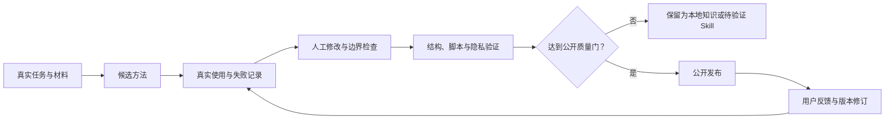
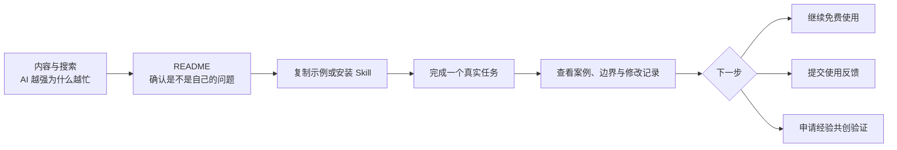

# 君一方法论

**让 AI 学会你的经验和判断，而不是让更多工作回到你手里。**

面向已经开始用 AI 做真实工作的一人公司经营者、知识型创作者和创业父母：把真实材料、长期经验与判断标准，变成 Agent 可以调用、可以验证、可以持续修订的方法。

[](https://github.com/junyifei/junyi-skills/releases)
[](skill-index.json)
[](LICENSE)

当前公开版：**1.2.0** · 正式入口与 Skills：**11 个**

[30 秒开始](#30-秒开始) · [安装](#安装) · [公开能力](#公开能力) · [案例与示例](#案例与输出示例) · [方法证据](#方法从哪里来) · [反馈与共创](#反馈与共创)

## 君一方法论首先服务谁

首先服务这样的人：已经有真实业务、专业经验或长期创作，也已经开始使用 AI，但仍然遇到这些情况：

| 真实处境 | 君一方法论帮助推进什么 |
|---|---|
| 每次使用 AI 都要重新解释背景 | 整理真实材料、上下文和任务边界 |
| AI 输出越来越多，审核反而越来越累 | 说清 AI、团队和人的判断边界 |
| 多年经验都在脑子里，难以交给别人 | 把经验、标准和流程变成可调用的方法 |
| 个人 IP 什么都能讲，用户却记不住 | 用证据区分定位、愿望和待验证假设 |
| 找了很多对标，只学到标题和表面形式 | 建立可核验、可比较的对标研究 |
| 面对重要选择，AI 总顺着自己说 | 用追问和反方审查保留人的判断 |
| 工作更高效了，事业与生活却没有变轻 | 重新判断什么值得做、什么可以停止 |

最鲜明的核心人群，是同时承担事业、家庭和自我成长的创业妈妈；公开 Skills 也适用于有相同任务结构的创作者、咨询师、教练、专家和一人公司经营者。

这里不提供最新工具清单、一键搞钱承诺、企业级系统实施，也不替用户承担最终判断。

## 一条可以持续使用的方法路径

君一方法论不从“让 AI 多写一点”开始，而从个人每天真实产生的材料开始：

```text
把自己的生活提炼出来
→ 把外部学习消化掉
→ 搭好自己的知识库
→ 把新内容持续归进去
```

| 真实任务 | 对应 Skill | 得到什么 |
|---|---|---|
| 每日录音、长录音或生活记录很散 | `junyi-content-distiller` | 核心事件、情绪、故事、观点、证据、原则与待办 |
| 课程、文章、书和访谈看过却没有变成自己的理解 | `junyi-learning-distiller` | 主张证据、自己的复述、适用边界和小实验 |
| 想从零搭知识库，或已有知识库越来越乱 | `junyi-vault` | 建库、诊断、归档三种模式与可预览的安全变更 |
| 想让真实经验最终成为对外可理解的个人品牌 | `junyi-positioning`、`junyi-personal-website` | 唯一《IP战略书》和一条可验证的网站转化路径 |

这条路径不是强制流水线。已有清楚知识库的人可以直接归档，已有完整定位的人可以直接建官网；总入口只选择当前最短的一步。

## 30 秒开始

不知道该从哪里开始时，在支持 Skills 的 Agent 中输入：

```text
$junyi
我已经在用 AI 做内容，但产量增加以后，审核时间也增加了。
请判断我现在需要整理材料、明确判断标准，还是调整工作流。
```

需要做个人 IP 定位时：

```text
$junyi-positioning
我是一名有十年经验的家庭教育从业者，已经有课程和客户，
但账号同时讲育儿、女性成长和创业，用户记不住我。
请先区分事实、推断、假设和未知，再判断定位问题出在哪里。
```

需要找小红书对标时：

```text
$junyi-xhs-benchmark
我要为“创业妈妈使用 AI”寻找小红书对标。
不要只给粉丝最多的账号，请区分内容参考、人设参考、产品参考和低粉爆款样本。
```

需要整理一段每日录音时：

```text
$junyi-content-distiller
请把这段录音按“今日核心事件、情绪地图、故事、观点、金句、场景、冲突、数据案例、决策原则、工作待办安排”的顺序蒸馏。
所有结论保留原话或时间戳证据，先确认说话人，不要补写没有发生的事。
```

知识库很乱、不敢直接搬文件时：

```text
$junyi-vault
先只读扫描我的知识库，告诉我现有规则、冲突和最小修复方案。
未经我确认，不要创建目录、移动文件或覆盖笔记。
```

不同 Agent 的显式调用方式不完全相同：Codex 等环境可使用 `$skill-name`；只有原生支持斜杠命令的客户端才使用 `/junyi`。自然语言写“使用 junyi 帮我选择”也可以。详见 [新手指南](guide/START-HERE.md)。

## 安装

### 一键安装全部公开 Skills

```bash
npx -y skills add junyifei/junyi-skills -g --all
```

### 只安装单个 Skill

```bash
npx -y skills add junyifei/junyi-skills --skill junyi-positioning
```

只安装指定的 Skill，不写入其他公开 Skills。把名称替换为任意一个公开 Skill 即可。全局安装与更多写法见 [新手指南](guide/START-HERE.md)。

查看仓库能被识别出的 Skills，不执行安装：

```bash
npx -y skills add junyifei/junyi-skills --list
```

本仓库已在隔离项目中验证：安装工具能够发现并复制全部 11 个公开 Skills。不同 Agent 的目录、调用语法和能力支持仍可能不同，请查看 [兼容性与安装说明](guide/COMPATIBILITY.md)。

如果不使用安装工具，也可以只复制需要的 Skill 目录。以 Codex 项目级安装为例：

```bash
mkdir -p .agents/skills
cp -R junyi .agents/skills/
cp -R junyi-positioning .agents/skills/
cp -R junyi-xhs-benchmark .agents/skills/
```

安装前先检查同名目录，避免覆盖本地未同步的修改。安装后开启新会话，让 Agent 重新发现 Skills。

## 公开能力

### 总入口

| Skill | 什么时候使用 | 常见产出 | 成熟度 |
|---|---|---|---|
| [`junyi`](junyi/SKILL.md) | 不知道该用哪个 Skill，或希望选择最短路径 | 一个明确入口、缺失材料和下一步 | 已发布 |

### 人的判断

| Skill | 什么时候使用 | 常见产出 | 成熟度 |
|---|---|---|---|
| [`junyi-deep-dialogue`](junyi-deep-dialogue/SKILL.md) | 有体验、矛盾或选择，但还没有想清楚 | 逐层追问、自己的判断、可选觉知记录 | 已发布 |
| [`junyi-po-leng-shui`](junyi-po-leng-shui/SKILL.md) | 只有用户明确要求挑刺、找漏洞或魔鬼代言人时 | 关键漏洞、反证、失败风险 | 已发布 |

### 真实材料与家庭实践

| Skill | 什么时候使用 | 常见产出 | 成熟度 |
|---|---|---|---|
| [`junyi-doc-reader`](junyi-doc-reader/SKILL.md) | 大文档需要转换、分块、索引或归档 | 结构化 Markdown、分块索引和归档结果 | 已发布 |
| [`junyi-growth-spark-recorder`](junyi-growth-spark-recorder/SKILL.md) | 想记录孩子的具体片段并理解为什么有效 | 事件记录、发展观察、思维模型复盘 | 已发布 |

### 证据型个人 IP

| Skill | 什么时候使用 | 常见产出 | 成熟度 |
|---|---|---|---|
| [`junyi-positioning`](junyi-positioning/SKILL.md) | 设计、审核或迭代个人 IP 定位与战略 | 定位决定、证据边界、验证计划或完整战略书 | 已投入真实项目 |
| [`junyi-xhs-benchmark`](junyi-xhs-benchmark/SKILL.md) | 需要发现、核验、分层和选择小红书对标 | 候选池、排除理由、分层评分与使用建议 | 测试中 |

这里只公开目前愿意承担方法承诺的能力。用户研究、选题、标题、内容生产与审核等方法仍在本地实盘验证；验证通过前，不因为数量好看而发布。

### 1.2.0 新增公开能力

| Skill | 什么时候使用 | 已完成的质量门 | 当前状态 |
|---|---|---|---|
| [`junyi-content-distiller`](junyi-content-distiller/SKILL.md) | 蒸馏短记录、每日录音或超长录音，并保留证据与断点 | 29 项分块、隔离、合并、证据、隐私与结构测试 | 已发布 |
| [`junyi-learning-distiller`](junyi-learning-distiller/SKILL.md) | 把课程、文章、书和访谈转成自己的理解与实验 | 7 项长材料、层级、证据与边界测试 | 已发布 |
| [`junyi-vault`](junyi-vault/SKILL.md) | 新建知识库、把新内容归档，或只读诊断混乱知识库 | 15 项安全测试、26 项五类用户情境测试 | 已发布 |
| [`junyi-personal-website`](junyi-personal-website/SKILL.md) | 用文件型 AI 从定位、设计、实现走到部署验收 | 官方技术复核、9 项静态站点校验测试 | 已发布 |

这些质量门证明结构、脚本与安全约束已经过测试，不等同于承诺涨粉、收入或其他市场结果。

## 尚未公开的能力

儿童成长全年规划与 IP 用户研究、选题、标题、内容生产、内容审核等能力仍在本地实盘验证，不进入公开总路由和机器索引。验证通过前，不因为数量好看而发布。

`daily-recording-distiller` 的通用方法已经吸收到 `junyi-content-distiller`，不会公开家庭成员、内部 Agent、账号或私人路径。`junyi-vault-builder` 与 `junyi-vault-filer` 已在产品层合并为 `junyi-vault`，由模式路由保持建库、归档和只读诊断的操作隔离。

## 案例与输出示例

- [`junyi-positioning` 真实仓库定位案例](examples/junyi-positioning-junyi-methodology.md)：展示“Skill 合集”怎样被重新判断为“公开方法实验室”，包含证据、决定、未知与不承诺事项。
- [`junyi-xhs-benchmark` 合成输出示例](examples/junyi-xhs-benchmark-synthetic.md)：展示候选池、核验、分层和排除逻辑；示例账号与数字均为合成数据，不代表平台事实。

示例的目的不是证明“使用后一定涨粉或成交”，而是让用户在安装前看清输入要求、推理边界和交付结构。

## 方法从哪里来

君一方法论来自一人公司经营、内容创作、课程与咨询、家庭实践、长期记录以及 Agent 真实工作流。它不是把一组好听的提示词包装成产品。

每个正式 Skill 都必须回答：

1. 什么真实任务会触发它；
2. 需要哪些材料和证据；
3. 按什么步骤执行；
4. 怎样判断完成、失败或需要补充信息；
5. 哪些决定必须留给人；
6. 好结果、差结果和人工修改怎样进入下一版本。



详细的证据等级、公开质量门和当前能说到什么程度，见 [方法与证据说明](guide/METHOD-AND-EVIDENCE.md)。

## GitHub 怎样承接用户



GitHub 是方法体验和能力证明中心，不是结果承诺页。真正的信任来自可检查的过程、产物、边界和持续修订，而不是 Stars、粉丝数或一条爆款。

## 产品结构

```text
junyi-skills/
├── junyi/                 # 总入口，只负责诊断与路由
├── <skill-name>/          # 可以独立安装的正式 Skill
├── examples/              # 真实案例或明确标注的合成示例
├── guide/                 # 新手、兼容性、证据与使用说明
├── knowledge/             # 尚未晋升为 Skill 的公开规则与知识卡
├── tools/                 # 资产盘点和仓库维护工具
└── skill-index.json       # 机器可读的公开清单
```

方法成熟度与版本不写进 `SKILL.md` frontmatter，以保持跨平台兼容；机器可读状态统一记录在 [`skill-index.json`](skill-index.json)。

## 反馈与共创

### 使用中遇到问题

- [报告 Skill 或安装问题](https://github.com/junyifei/junyi-skills/issues/new?template=problem.yml)
- [提交一次脱敏使用反馈](https://github.com/junyifei/junyi-skills/issues/new?template=usage-feedback.yml)

提交前请删除客户姓名、孩子身份、联系方式、账号凭据、私有链接和未授权材料。敏感问题请先阅读 [`SECURITY.md`](SECURITY.md)，不要放入公开 Issue。

### “让 AI 开始学会你”共创验证

如果你已经有稳定业务或专业工作，关键任务仍依赖你的经验和判断，可以提交一份[公开的、非敏感的共创意向](https://github.com/junyifei/junyi-skills/issues/new?template=co-creation-interest.yml)。

当前状态：**首轮验证中**。这不是企业级技术实施，也不承诺收入增长。公开 Issue 只用于确认任务是否适合；客户资料、业务数据和正式交付材料不得上传到 GitHub。

## 更新

查看 [GitHub Releases](https://github.com/junyifei/junyi-skills/releases) 与 [`CHANGELOG.md`](CHANGELOG.md)。更新前保留自己的本地修改和私有资料；公开仓库不会保存你的个人工作记录。

## 原创与许可

本仓库是君一基于自己的实战、记录、课程、咨询和内容项目独立蒸馏的方法论实现，不复制第三方项目的具体文案、代码、视觉资产或品牌表达。

本仓库采用 [CC BY 4.0](LICENSE)：可以使用、修改和再分发，包括商业使用；请署名“君一”并保留许可链接。权利与迁移记录见 [`RIGHTS.md`](RIGHTS.md)。

## 作者

君一 · 费君一

一人公司妈妈，持续记录一群 AI 怎样进入真实公司与生活，以及人怎样把判断、责任、关系和重要生活留给自己。
