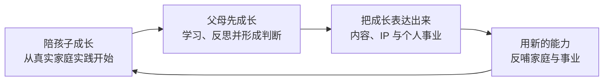

# 君一的 AI 时代家庭教育 Skills

**Junyi’s AI-Era Family Education Skills**

## 育儿先育己，让 AI 学会你

这里的 AI 时代家庭教育，不是让孩子更早使用 AI，而是帮助父母理解孩子、成长自己，并把家庭实践中的经验与判断转化为行动、表达和事业。

让 AI 学会你的真实材料、长期经验和判断标准，让真实生活成为教育发生的地方。

首先为关心 AI 时代家庭成长、事业发展和自我成长的父母设计；也适用于希望从真实生活出发，理解孩子、更新自己，并把成长经验转化为内容、影响力或事业能力的人。

[](https://github.com/junyifei/junyi-skills/releases)
[](skill-index.json)
[](LICENSE)

当前公开版：**1.4.0** · 正式入口与 Skills：**19 个**

[成长闭环](#一条完整的成长闭环) · [30 秒开始](#30-秒开始) · [安装](#安装) · [三个成长阶段](#三个成长阶段) · [代表案例](#三个可检查的代表案例) · [反馈与共创](#继续使用关注与共创)

## 一条完整的成长闭环

这些 Skills 不是三个互不相关的领域，而是一条从家庭出发、回到家庭与事业的成长路径：



| 你正处在哪个阶段 | 什么时候使用 | 用完得到什么 |
|---|---|---|
| [陪孩子成长](#陪孩子成长) | 想记录和理解孩子，建立全年成长底座，或更新未来 90 天行动 | 成长记录、Agent 可读的全年底座和家长可执行的季度计划 |
| [父母先成长](#父母先成长) | 想消化外部学习、整理知识，或把一个重要问题真正想清楚 | 自己的理解、知识结构、判断、反证和行动实验 |
| [把成长表达出来](#把成长表达出来) | 想把育儿、生活与专业经验转化为内容、IP 或个人事业 | 可追溯内容素材、IP 战略、对标研究和个人官网 |

不知道自己处在哪个阶段时，使用总入口 `$junyi`。它只选择当前最需要的一个 Skill 或一条最短路径，不会把 19 个 Skill 全部运行一遍。

这里不鼓励把孩子变成项目，也不让 AI 代替父母作教育决定；不提供一键搞钱承诺、医学心理诊断或未经证据支持的成长结果预测。

## 30 秒开始

在支持 Skills 的 Agent 中复制：

```text
$junyi
我现在要完成的是：……
我已经有的真实材料是：……
我最担心 AI 编造或误判的是：……
请只选择当前最短的一步，并告诉我用完会得到什么。
```

如果客户端不支持 `$skill-name`，直接写“使用 junyi 帮我选择”即可。只有原生注册斜杠命令的客户端才使用 `/junyi`。

## 安装

安装全部公开 Skills：

```bash
npx -y skills add junyifei/junyi-skills -g --all
```

只安装一个 Skill：

```bash
npx -y skills add junyifei/junyi-skills --skill junyi-content-distiller
```

先查看仓库能够识别出哪些 Skills，不执行安装：

```bash
npx -y skills add junyifei/junyi-skills --list
```

本仓库已在隔离项目中验证 19/19 发现与复制安装。安装后开启新会话，让 Agent 重新发现 Skills。不同 Agent 的目录、调用语法和脚本能力仍可能不同，详见[兼容性与安装说明](guide/COMPATIBILITY.md)。

## 三个成长阶段

### 陪孩子成长

孩子成长链按“成长记录 → 全年底座 → 季度行动”工作。全年底座优先给 Agent 长期读取，季度计划优先给家长行动。

| 什么时候使用 | 最短路径 | 会得到什么 |
|---|---|---|
| 只想记录并理解一个孩子的具体片段 | [`junyi-growth-spark-recorder`](junyi-growth-spark-recorder/SKILL.md) | 事件记录、发展观察与家长复盘 |
| 第一次建立 0—12 岁孩子的全年成长底座 | [`collect-child-growth-intake`](collect-child-growth-intake/SKILL.md) → 一个分龄全年规划 Skill | `intake.json`、证据地图和给 Agent 长期读取的全年底座 |
| 已有全年底座，要更新未来 90 天 | [`collect-child-quarterly-update`](collect-child-quarterly-update/SKILL.md) → 一个分龄季度计划 Skill | 本季证据状态、家长行动指南、最低版本和复盘信号 |

全年与季度都只进入一个年龄轨道。季度问卷不能替代首次全年资料采集；没有持续日常记录时，可以使用年龄自适应季度问卷。完整的 9 个家庭教育 Skill、年龄边界和输入要求见[全部 Skill 用户目录](guide/SKILL-CATALOG.md#陪孩子成长)。

### 父母先成长

| 什么时候使用 | 使用入口 | 会得到什么 |
|---|---|---|
| 课程、文章和书看过，却没有变成自己的理解 | [`junyi-learning-distiller`](junyi-learning-distiller/SKILL.md) | 来源主张、自己的复述、适用边界和小实验 |
| 大文档需要转换、分块、索引或归档 | [`junyi-doc-reader`](junyi-doc-reader/SKILL.md) | 结构化 Markdown、分块索引和归档结果 |
| 想从零搭知识库，或已有知识库越来越乱 | [`junyi-vault`](junyi-vault/SKILL.md) | 建库、归档或只读诊断方案 |
| 有体验、情绪、矛盾或选择，但还没想清楚 | [`junyi-deep-dialogue`](junyi-deep-dialogue/SKILL.md) | 逐层追问、自己的判断和可选觉知记录 |
| 已有一个方案，明确希望有人挑刺、找漏洞 | [`junyi-po-leng-shui`](junyi-po-leng-shui/SKILL.md) | 关键漏洞、反证与最可能失败的位置 |

学习不是囤积答案，而是形成自己的理解、边界和行动实验。反方审查必须由用户明确触发；普通对话不会因为 Agent 猜测用户需要“被泼冷水”而自动调用。

### 把成长表达出来

| 什么时候使用 | 使用入口 | 会得到什么 |
|---|---|---|
| 录音、日记和生活记录很多，想提炼真实内容 | [`junyi-content-distiller`](junyi-content-distiller/SKILL.md) | 核心事件、情绪、故事、观点、证据、原则和待办 |
| 育儿与专业经验很多，但别人记不住你是谁 | [`junyi-positioning`](junyi-positioning/SKILL.md) | 证据型《IP 战略书》、定位决定与验证计划 |
| 需要寻找和核验小红书对标 | [`junyi-xhs-benchmark`](junyi-xhs-benchmark/SKILL.md) | 候选池、排除理由、分层评分与使用建议 |
| 已有定位与真实素材，想建立个人官网 | [`junyi-personal-website`](junyi-personal-website/SKILL.md) | 原创、可验证、可部署的网站 |

表达不是把孩子当作内容素材，也不是要求每位父母都经营 IP。它只在用户主动选择时，帮助把自己的学习、育儿感悟与专业经验变成可追溯的公共表达。

查看[全部 19 个 Skill 用户目录](guide/SKILL-CATALOG.md)：按“什么时候用、准备什么、得到什么”选择；机器可读的版本与成熟度见 [`skill-index.json`](skill-index.json)。

## 三个可检查的代表案例

| 案例 | 输入 | 可检查产出 | 人工修改与边界 |
|---|---|---|---|
| [GitHub 定位改版](examples/junyi-positioning-junyi-methodology.md) | 一个能力很多、共同问题不清楚的 Skill 仓库 | 首先服务谁、共同问题、证据与验证项 | 撤下未验证能力；不把 Stars、涨粉和成交写成既有结果 |
| [超长录音隔离回归](examples/content-distiller-regression.md) | 多分块录音与说话人、时间戳证据 | 分块产物、合并顺序、断点和证据门 | 把“建议并行”改成超过阈值必须隔离执行；不公开真实家庭录音 |
| [儿童计划能动性回归](examples/child-growth-agency-regression.md) | 明确未让孩子参与设计的合成资料 | 证据型全年底座与待确认行动 | 删除“孩子共同设计”等虚假归因；不把结构测试冒充成长结果 |

案例用于展示输入、方法、人工修订和边界，不证明任何人使用后一定涨粉、成交或获得特定儿童发展结果。

## 方法与证据

这些 Skills 来自家庭教育实践、一人公司经营、内容创作、课程与咨询、长期记录以及 Agent 真实工作流。每个正式 Skill 必须说清：什么时候触发、需要什么材料、怎样执行、何时完成或停机、哪些决定必须留给人。

重要陈述分为四类：

| 标签 | 含义 |
|---|---|
| 事实 | 有原始记录、可观察结果或可靠来源 |
| 推断 | 由事实支持的当前解释，仍可能有其他解释 |
| 假设 | 可以用行动检验、但尚未被证明 |
| 未知 | 做决定需要、当前没有的信息 |

结构测试和脚本通过只说明已知规则得到验证，不等于市场结果、家庭结果或专业评估成立。详细质量门、成熟度和当前能说到什么程度，见[方法与证据说明](guide/METHOD-AND-EVIDENCE.md)。

## 本次更新

**v1.4.0**：补齐儿童全年资料采集、三个分龄全年知识底座，以及它们与季度行动计划的完整公开链。全年四个 Skill 完成 15 个匿名合成案例前向回归、严重能动性归因缺陷修复和关键案例独立重跑。

历史版本与完整变更进入 [`CHANGELOG.md`](CHANGELOG.md) 和 [GitHub Releases](https://github.com/junyifei/junyi-skills/releases)，不在首页重复展开。

## 继续使用、关注与共创

| 你想继续做什么 | 入口 |
|---|---|
| 立即安装并完成第一个任务 | [回到 30 秒开始](#30-秒开始) |
| 关注公开版本、案例和修订 | [GitHub Releases](https://github.com/junyifei/junyi-skills/releases) · [君一的 GitHub](https://github.com/junyifei) |
| 报告安装或 Skill 问题 | [提交可公开复现的问题](https://github.com/junyifei/junyi-skills/issues/new?template=problem.yml) |
| 告诉我哪里有效、哪里失败、你怎样修改 | [提交脱敏使用反馈](https://github.com/junyifei/junyi-skills/issues/new?template=usage-feedback.yml) |
| 有一个真实的家庭、学习或表达任务，希望让 AI 开始学会你的经验 | [申请首轮经验共创验证](https://github.com/junyifei/junyi-skills/issues/new?template=co-creation-interest.yml) |

公开 Issue 不接收客户资料、孩子身份、业务数据、账号凭据、私有链接或联系方式。敏感问题请先阅读 [`SECURITY.md`](SECURITY.md)。共创仍处于首轮验证，不是成熟的企业级实施服务，也不承诺收入增长。

## 尚未公开的能力

IP 用户研究、选题、标题、内容生产和内容审核等能力仍在本地实盘验证，不进入公开总路由和机器索引。验证通过前，不因为数量好看而发布。

`daily-recording-distiller` 的通用方法已吸收到 `junyi-content-distiller`；`junyi-vault-builder` 与 `junyi-vault-filer` 已在产品层合并为 `junyi-vault`。家庭成员、内部 Agent、账号资源、私人路径和未授权案例不属于公开仓库。

## 原创、许可与作者

本仓库由君一基于自己的实战、记录、课程、咨询和内容项目独立蒸馏，不复制第三方项目的具体文案、代码、视觉资产或品牌表达。

本仓库采用 [CC BY 4.0](LICENSE)：可以使用、修改和再分发，包括商业使用；请署名“君一”并保留许可链接。权利与迁移记录见 [`RIGHTS.md`](RIGHTS.md)。

**君一 · 费君一**

一人公司妈妈，持续实践 AI 时代的家庭教育：陪孩子成长，也让父母在教育中成长，并把新的理解与能力带回家庭和事业。
