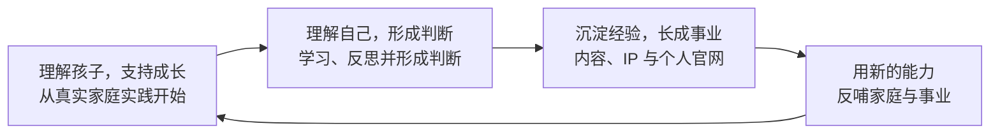

# 君一的 AI 协作 Skills

**Junyi’s AI Collaboration Skills**

## 让 AI 学会你的经验、判断与方法

这些 Skills 不只服务于育儿。它们来自我与 AI 团队在事业创造、家庭经营、关系经营和生命成长中的真实协作。

我把反复有效的经验、判断与方法，沉淀成可以安装、调用、验证并持续更新的能力。它们与 Agent、知识库和工作流一起，组成一套持续生长的超级个人 AI 工作台。

这里首先为同时承担事业与家庭责任的创业者父母设计，也适合希望让 AI 长期理解自己、参与真实工作与生活的人。

> 这些 Skill 来自我在家庭教育、长期社群、一人公司与 AI 协作中的真实实践。完整背景和其他内容：[junyiainative.com](https://junyiainative.com)

[](https://github.com/junyifei/junyi-skills/releases)
[](skill-index.json)
[](LICENSE)

当前公开版：**1.6.0** · 正式入口与 Skills：**21 个**（干活的 Skill 20 个 + 「君一 Skills 导航」1 个）

[家庭成长 Agent](#家庭成长-agent超级个人-ai-工作台中的一个子系统) · [成长闭环](#一条完整的成长闭环) · [30 秒开始](#30-秒开始) · [安装](#安装) · [三个成长阶段](#三个成长阶段) · [使用与共创](#继续使用与共创)

## 家庭成长 Agent：超级个人 AI 工作台中的一个子系统

家庭成长 Agent 不是这套 AI 协作系统的全部，而是它在孩子成长与家庭教育领域的一项具体应用。它持续了解同一个孩子和家庭，帮助父母整理真实材料、理解变化、形成行动并根据结果复盘；陪伴、沟通、教育判断和最终决定始终由父母完成。

它可以部署在你自己的电脑上，作为长期服务于同一个家庭的 AI 协作系统。这里的「训练」不是重新训练大模型参数，而是持续把家庭的真实回答、现成报告、日常片段、行动结果和人的更正交给同一个 Agent，让它越来越了解这个家庭。

**育儿先育己，让 AI 学会你。**这是家庭成长子系统的价值表达，不代表整套 AI 协作实践的全部。

长期使用后，一个家庭会逐渐拥有：

- 一条会随孩子一起生长的教育规划路线；
- 一套经过真实生活验证的家庭判断方法；
- 一条可以回看、可以更正的成长脉络；
- 更多用于游戏、聊天、运动、旅行和真实陪伴的时间与心力。

开始时不需要准备复杂的「私密工作空间」。准备一台日常使用的电脑，在本地使用一个能安装 Skill、读取文件的 Agent 即可。第一次建立全年底座时，预留 10 到 20 分钟回答问卷；如果手边有现成的学校报告、体检报告或儿保报告，可以作为辅助材料交给本地 Agent。没有报告也可以开始，不需要额外制造材料。

| 组件 | 解决的问题 | 主要使用者 | 何时使用 |
|---|---|---|---|
| 全年知识底座 | 让 Agent 首次系统了解这个孩子和家庭 | Agent 长期读取 | 第一次搭建，或整体情况发生重大变化时 |
| 季度行动指南 | 把长期方向和最新证据转成未来 90 天的少数行动 | 父母与孩子 | 已有全年底座，需要进入下一季度时 |
| 日常真实记录 | 把生活中的新变化和家长的新理解带回 Agent | 家庭成员与 Agent | 有值得保留的具体片段时 |

## 一条完整的成长闭环

这些 Skills 不是三个互不相关的领域，而是一条从家庭出发、回到家庭与事业的成长路径：


```mermaid
flowchart LR
    A["理解孩子，支持成长<br/>从真实家庭实践开始"] --> B["理解自己，形成判断<br/>学习、反思并形成判断"]
    B --> C["沉淀经验，长成事业<br/>内容、IP 与个人官网"]
    C --> D["用新的能力<br/>反哺家庭与事业"]
    D --> A
```

| 你正处在哪个阶段 | 什么时候使用 | 用完得到什么 |
|---|---|---|
| [理解孩子，支持成长](#理解孩子支持成长) | 想记录和理解孩子，建立全年成长底座，或更新未来 90 天行动 | 成长记录、Agent 可读的全年底座和家长可执行的季度计划 |
| [理解自己，形成判断](#理解自己形成判断) | 想消化外部学习、整理知识，或把一个重要问题真正想清楚 | 自己的理解、知识结构、判断、反证和行动实验 |
| [沉淀经验，长成事业](#沉淀经验长成事业) | 想把育儿、生活与专业经验转化为内容、IP 或一人公司事业 | 可追溯内容素材、IP 战略、对标研究和个人官网 |

不知道自己处在哪个阶段时，使用「君一 Skills 导航」。在支持显式 Skill 调用的环境中，它的技术名称是 `$junyi`。它只选择当前最需要的一个 Skill 或一条最短路径，不会把 20 个 Skill 全部运行一遍。

这里不鼓励把孩子变成项目，也不让 AI 代替父母作教育决定；不承诺收入结果，不做医学、心理或发育诊断，也不预测未经证据支持的成长结果。

## 30 秒开始

打开你平时用的 AI 助手（比如 Claude），像平时说话一样把难题告诉它，比如：

```text
我现在有个问题想解决：……。君一的 GitHub 仓库 junyifei/junyi-skills 里，有没有能帮我的 skill？是哪一个？帮我装上。
```

它会帮你挑出最合适的那个、装好，再告诉你怎么用。不用你自己判断该装哪个。

## 安装

装 Skill 不用自己敲命令行。打开一个能安装 Skill、能读文件的 AI 助手（比如 Claude），把下面对应的那句话整段发给它，它会自己去 GitHub 上装好。

**第一次搭建**——先装「全年资料采集」这一个：

```text
请帮我从君一的 GitHub 仓库 junyifei/junyi-skills，安装 junyi-child-annual-intake 这个 skill。
```

它装完会生成一份 `routing-result.md`，告诉你孩子该走哪个年龄轨道。照它说的，再装那一个全年规划 Skill：

```text
请按 routing-result.md 的结果，从 junyifei/junyi-skills 帮我装对应年龄的那一个全年规划 skill（junyi-infant-annual-plan、junyi-preschool-annual-plan、junyi-school-age-annual-plan 里选一个）。
```

**已经有全年底座，想更新未来 90 天**——先装季度采集，再装它帮你选出的那一个季度 Skill：

```text
请帮我从 junyifei/junyi-skills 安装 junyi-child-quarterly-intake，然后按它的结果，再装对应年龄的那一个季度规划 skill。
```

**想随手记录亲子片段**（可选）：

```text
请帮我从 junyifei/junyi-skills 安装 junyi-growth-spark-recorder 这个 skill。
```

**想复盘这一周和 AI 都做了什么**：

```text
请帮我从君一的 GitHub 仓库 junyifei/junyi-skills，安装 junyi-ai-weekly-review 这个 skill。运行前先告诉我哪些步骤只在本地、哪些内容可能由云端模型处理。
```

**只想先看看仓库里有哪些 Skill、暂时不装**：

```text
帮我看看君一的 GitHub 仓库 junyifei/junyi-skills 里都有哪些 skill，先别安装。
```

**确实想把公开的 Skill 全装上**（一般用不着）：

```text
请帮我把 GitHub junyifei/junyi-skills 里公开的 skill 都装上。
```

装好后，新开一个对话让 AI 重新识别一下就能用了。本仓库已在隔离项目中验证 21/21 发现与复制安装；不同 AI 助手的目录和用法可能不太一样，详见[兼容性与安装说明](guide/COMPATIBILITY.md)。

<details>
<summary>习惯命令行，或你的工具需要精确命令？点这里</summary>

用 `skills` CLI 安装（把 `<SKILL>` 换成想装的名字）：

```bash
npx -y skills add junyifei/junyi-skills --skill <SKILL>
```

- 全年：`junyi-child-annual-intake` → 按 `routing-result.md` 再装 `junyi-infant-annual-plan`、`junyi-preschool-annual-plan`、`junyi-school-age-annual-plan` 之一
- 季度：`junyi-child-quarterly-intake` → 再装对应年龄的 `junyi-*-quarterly-plan` 之一
- 日常记录：`junyi-growth-spark-recorder`
- 只看不装：`npx -y skills add junyifei/junyi-skills --list`
- 全部装上：`npx -y skills add junyifei/junyi-skills -g --all`

原生支持斜杠命令的客户端可直接用 `/junyi`；其他客户端写 `$junyi` 或“使用 junyi 帮我选择”。
</details>

## 三个成长阶段

### 理解孩子，支持成长

孩子成长链按“建立全年知识底座 → 生成季度行动 → 留下日常真实记录 → 复盘与更正”工作。全年底座优先给家庭成长 Agent 长期读取，季度计划优先给父母和孩子进入真实生活。

| 什么时候使用 | 最短路径 | 会得到什么 |
|---|---|---|
| 只想记录并理解一个孩子的具体片段 | [`junyi-growth-spark-recorder`](junyi-growth-spark-recorder/SKILL.md) | 事件记录、发展观察与家长复盘 |
| 第一次让家庭成长 Agent 系统了解 0—12 岁孩子 | [`junyi-child-annual-intake`](junyi-child-annual-intake/SKILL.md) → 一个分龄全年规划 Skill | `intake.json`、证据地图和 Agent 长期读取的全年知识底座 |
| 已有全年底座，要更新未来 90 天 | [`junyi-child-quarterly-intake`](junyi-child-quarterly-intake/SKILL.md) → 一个分龄季度计划 Skill | 本季证据状态、家长行动指南、最低版本和复盘信号 |

全年与季度都只进入一个年龄轨道。季度问卷不能替代首次全年资料采集；没有持续日常记录时，可以使用年龄自适应季度问卷。完整的 9 个家庭教育 Skill、年龄边界和输入要求见[全部 Skill 用户目录](guide/SKILL-CATALOG.md#理解孩子支持成长)。

### 理解自己，形成判断

| 什么时候使用 | 使用入口 | 会得到什么 |
|---|---|---|
| 课程、文章和书看过，却没有变成自己的理解 | [`junyi-learning-distiller`](junyi-learning-distiller/SKILL.md) | 来源主张、自己的复述、适用边界和小实验 |
| 大文档需要转换、分块、索引或归档 | [`junyi-doc-reader`](junyi-doc-reader/SKILL.md) | 结构化 Markdown、分块索引和归档结果 |
| 想从零搭知识库，或已有知识库越来越乱 | [`junyi-vault`](junyi-vault/SKILL.md) | 建库、归档或只读诊断方案 |
| 有体验、情绪、矛盾或选择，但还没想清楚 | [`junyi-deep-dialogue`](junyi-deep-dialogue/SKILL.md) | 逐层追问、自己的判断和可选觉知记录 |
| 已有一个方案，明确希望有人挑刺、找漏洞 | [`junyi-po-leng-shui`](junyi-po-leng-shui/SKILL.md) | 关键漏洞、反证与最可能失败的位置 |
| 想记住每一个重要的人、兑现承诺，看清自己的心力流向 | [`junyi-relationship-manager`](junyi-relationship-manager/SKILL.md) | 有来源标记、支持同名消歧的关系档案与本地跟进报告；进阶可配置飞书三表和自动提醒 |
| 想把这一周和 AI 协作的记录，复盘成周报和能写的素材 | [`junyi-ai-weekly-review`](junyi-ai-weekly-review/SKILL.md) | 本地采集并生成《本周记录》+《本周内容素材》；云端模型处理前会告知并确认（需 Node.js） |

记住重要的人、看清自己的心力流向，和想清楚自己一样，都是「理解自己，形成判断」的一部分。

学习不是囤积答案，而是形成自己的理解、边界和行动实验。反方审查必须由用户明确触发；普通对话不会因为 Agent 猜测用户需要“被泼冷水”而自动调用。

### 沉淀经验，长成事业

| 什么时候使用 | 使用入口 | 会得到什么 |
|---|---|---|
| 录音、日记和生活记录很多，想提炼真实内容 | [`junyi-content-distiller`](junyi-content-distiller/SKILL.md) | 核心事件、情绪、故事、观点、证据、原则和待办 |
| 经历、专业经验或想法很多，但别人记不住你是谁 | [`junyi-positioning`](junyi-positioning/SKILL.md) | 候选定位卡、定位诊断，或证据型《IP 战略书》与验证计划 |
| 需要寻找和核验小红书对标 | [`junyi-xhs-benchmark`](junyi-xhs-benchmark/SKILL.md) | 候选池、排除理由、分层评分与使用建议 |
| 已有定位与真实素材，想建立个人官网 | [`junyi-personal-website`](junyi-personal-website/SKILL.md) | 原创、可验证、可部署的网站 |

表达不是把孩子当作内容素材，也不是要求每位父母都经营 IP。它只在用户主动选择时，帮助把自己的学习、育儿感悟与专业经验变成可追溯的公共表达。

查看[全部 20 个 Skill 用户目录](guide/SKILL-CATALOG.md)：按“什么时候用、准备什么、得到什么”选择；机器可读的版本与成熟度见 [`skill-index.json`](skill-index.json)。

## 继续使用与共创

| 你想继续做什么 | 入口 |
|---|---|
| 立即安装并完成第一个任务 | [回到 30 秒开始](#30-秒开始) |
| 报告安装或 Skill 问题 | [提交可公开复现的问题](https://github.com/junyifei/junyi-skills/issues/new?template=problem.yml) |
| 告诉我哪里有效、哪里失败、你怎样修改 | [提交脱敏使用反馈](https://github.com/junyifei/junyi-skills/issues/new?template=usage-feedback.yml) |
| 有一个真实的家庭、学习或表达任务，希望让 AI 开始学会你的经验 | [申请首轮经验共创验证](https://github.com/junyifei/junyi-skills/issues/new?template=co-creation-interest.yml) |

公开 Issue 不接收客户资料、孩子身份、业务数据、账号凭据、私有链接或联系方式。敏感问题请先阅读 [`SECURITY.md`](SECURITY.md)。共创仍处于首轮验证，不是成熟的企业级实施服务，也不承诺收入增长。

## 原创、许可与作者

本仓库由君一基于自己的实战、记录、课程、咨询和内容项目独立蒸馏，不复制第三方项目的具体文案、代码、视觉资产或品牌表达。

本仓库采用 [CC BY-NC 4.0](LICENSE)：可以使用、修改和再分发，但仅限非商业用途；商业使用请先联系君一获得授权。请署名“君一”并保留许可链接。权利与迁移记录见 [`RIGHTS.md`](RIGHTS.md)。

**费君一｜享育心塾创始人｜企业 AI 转型与落地顾问**

长期服务创业者父母，也是一位两个孩子的妈妈。我持续把家庭教育、一人公司与 AI 协作中的真实经验，整理成可复用的方法与 Skill。

## 完整背景与更多内容

- 完整背景、其他内容和联系方式：[junyiainative.com](https://junyiainative.com)
- 免费知识库（不用装任何东西，打开就能读）：https://ask.feishu.cn/shared-space/7664065199162264514
