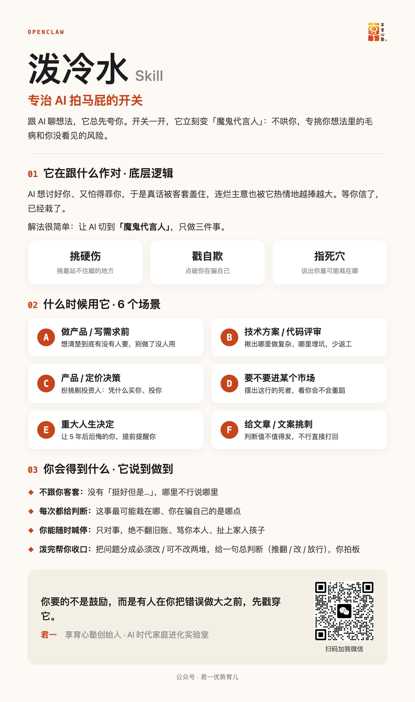

# 泼冷水 产品介绍

## 泼冷水是什么

**一个专治 AI 拍马屁的反谄媚开关。**

平时跟 AI 聊想法，它几乎总是先夸你。这个开关一开，它立刻切到「魔鬼代言人」：不再哄你，专挑你想法里的毛病、戳破你自己没看见的风险、指出这事最可能从哪儿崩。全程不给情绪价值。

---

## 它在对抗什么

AI 天生想讨好你、又怕得罪你，所以它的真话常被自己的客套盖住，连不靠谱的主意也会被它用同样的热情越捧越大，等你信了，已经栽了。

这个 skill 的解法很简单：强制 AI 切到「魔鬼代言人」，只做三件事，挑硬伤、戳自欺、指死穴。

---

## 适用场景

显式说出触发词后，它会自己判断你这次泼的是哪一类，自动套用对应模板：

| 场景 | 它帮你 |
|---|---|
| 做产品 / 写需求前 | 想清楚到底有没有人要，别做了没人用 |
| 技术方案 / 代码评审 | 揪出哪里做复杂、哪里埋坑，少返工 |
| 产品 / 定价决策 | 扮挑剔投资人：凭什么买你、投你 |
| 要不要进某个市场 | 摆出这行已经死掉的同行，看你会不会重蹈 |
| 重大人生决定 | 让「5 年后后悔的你」提前写信提醒你 |
| 给文章 / 文案挑刺 | 判断值不值得发，不行就直接打回重写 |

不适用：日常闲聊、你在情绪低谷期、只是想找灵感还没做决定时。

---

## 底层逻辑

它强制 AI 切到「魔鬼代言人」，靠三件事 + 一套护栏 + 一次收口：

**三件事**：挑硬伤（挑最站不住脚的假设）、戳自欺（点破你在骗自己的地方）、指死穴（告诉你最可能栽在哪）。

**护栏**：禁用一切软话（「挺好但是…」「大方向没问题」命中即重写）；只对事，绝不攻击你本人、翻旧账、扯家人孩子；你随时能喊「切回正常」叫停。

**收口（收敛三件套）**：泼完不甩一堆问题走人，而是帮你收口，把问题分成「必须改 / 可不改」两堆，给一句总判断（推翻重想 / 改了再上 / 直接放行），最后你拍板。

---

## 你会得到什么

- **不跟你客套**：哪里不行直接说哪里，没有垫话。
- **每次都给判断**：这事最可能栽在哪、你正在骗自己的是哪一点。
- **你始终能喊停**：只对事，不越界。
- **只戳破、不替你写**：不主动教你具体怎么改（除非你问），逼你自己想透，但会帮你收口给结论。

---

## 怎么触发

显式说出触发词才会启动（不会自动冒出来）。最简单的用法，直接打：

> 泼冷水：我想辞职去全职做自媒体，帮我泼一盆冷水

触发词：泼冷水 · 挑刺 · 找漏洞 · 给我泼一盆冷水 · 挑战这个想法 · 魔鬼代言人 · devil's advocate · 不要给我情绪价值 · 泼一下这篇稿 · 改稿挑刺
